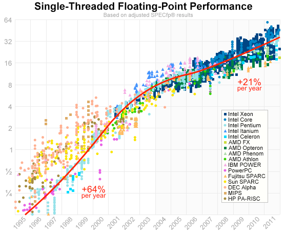
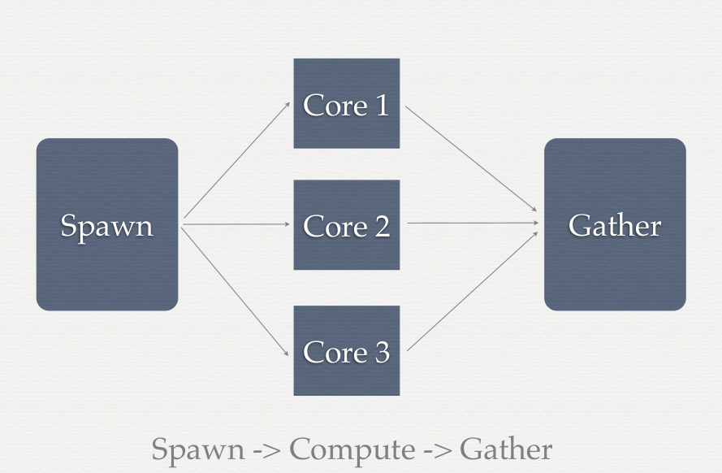
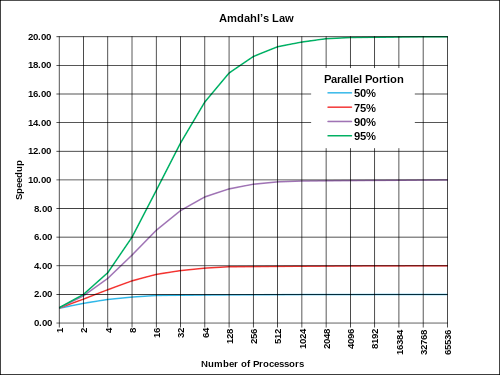

High-performance computing for Economists: Parallel processing
========================================================
transition: fade
author: Lars Vilhuber, based on previous presentation by Kevin McKinney
date: 2015/8/17-2015/8/19

Why parallel processing?
=======================
incremental: true

***
Single-core performance growth has slowed. More cost-effective to add multiple cores.

Threads vs processes
====================

Both can be used for parallel processing
* A process can launch multiple threads
  * Threads run only on the same node
  * Threads run within a process and have access to the memory and resources of that process
* A user or program can launch multiple processes (same or different node) and communicate via IPC or MPI
* Different tools for working with threads and processes, although the goal is the same

Parallel execution
==================

***
... or "map-reduce"...

Benefits vs costs
===============
incremental: true
Using cores can potentially do more work
***
But
* Each core needs access to the data (spawn)
* Each core needs to output results (gather)
* Additional programming and processing time required to implement solution in parallel

Dependencies
============
* Can you break the entire compute problem into independent chunks
  * Yes - potential candidate for parallel execution
  * No - not all of it
    * Identify the portions of the code that do not have dependencies
* The benefits of parallelization depend directly on the time spent executing parallel code

Amdahl's law
=============


***
$$ \lim_{P \to \inf} \frac{1}{\frac{1-\alpha}{P} + \alpha} = \frac{1}{\alpha} $$

* P = Number of cores
* $\alpha$ = proportion of time spent in parallel
* Diminishing returns to increasing P for a problem of fixed size

Example problem
===============
Calculate the column means of a data matrix
* Divide data into equal groups (blocks) of rows for parallel processing (spawn)
  * Is the array in memory or does it need to be read from disk?
  * Memory access is an order of magnitude faster than disk access
  * ... but has more limits
* Within each group, calculate the sum of each column
  * Store result (what if one core wants to write the result at the same time as another core?)
* Sum the results for each group and divide the total sample size

Example (continued)
===================
* Or: process only a single column at a time (column-store databases!)
* In general, if the groups are
  * large
  * numerous
  * amount of processing time for each group is high
* then it is worthwhile to execute in parallel

Considerations
==============
Both programming time and processing time should be considered when deciding on structure of program
* Carefule tuning of single-threaded application may be a better investment
* Does your program take days or weeks to find a solution?
* How often do you expect to run the code?
Before implementing a parallel solution, spend time assessing the expected benefit

Implicit vs Explicit
===================
Not necessarily a custom solution - switching software may also be worthwhile
* SAS, Stata, Matlab have internal parallel algorithms that will do much if not all of the hard work for you
  * they will spawn the threads and gather the results using well-tested routines
  * Your job is to manage the number of threads
* Programs assume all threads on a core are available to you (or limited by license)
  * On a large node, not always efficient
  * On a shared system, not allowed!

Taking control of implicit threads
==================================
* SAS
  * `THREADS` and `CPUCOUNT=X`
  * `NOTHREADS`
* Stata
  * `set processors X`
* Matlab
  * `-singleCompThread` (may not be exact)

Explicit processes
==================
PBS-like systems allow you spawn jobs automatically
* `qsub -t 1-100%5 script.qsub` runs 5 jobs at a time, from 1-100
* `$PBS_ARRAYID` is provided to the script, and can be used to pass to the program, for instance
  * SAS

```
%let sample=%sysget(PBS_ARRAYID);
data one;
  set LIBRARY.bigdata(where=(mod(_n_,100)=&sample.));
  run;
```
  * Similar in R, Matlab, potentially in Stata

Explicit processes
==================
Conditional execution
```
JOB_ID_1=$(qsub 01_script.sh)
JOB_ID_2=$(qsub -W depend=afterok:$JOB_ID_1 02_script.sh)
JOB_ID_3=$(qsub -W depend=afterok:$JOB_ID_2 03_script.sh)
```

Live demo
=========
For instance, try
* [2-dopar.R](../programs/day2/2-dopar.R)
Parallel processing
===================
Computing with four cores on laptop (and R 3.2)

```r
library(doParallel)
registerDoParallel(cores=4)
source("https://www.vrdc.cornell.edu/computing-for-economists/programs/day2/2-dopar.R", echo=FALSE)
```
For version 3.0 or earlier you need to modify something:

```r
library(doMC)
registerDoMC(cores=4)
source("https://www.vrdc.cornell.edu/computing-for-economists/programs/day2/2-dopar.R", echo=FALSE)
```

Parallel processing: results
===================

* Computing with four cores on laptop (and R 3.2): 15.285 seconds
* Computing with 1 core on ECCO (compute-0-4, R 3.0): 38.955 seconds ([source](../programs/day2/0-loadlibs.cpucount1.Rout))
* Computing with 32 cores on ECCO (compute-0-4, R 3.0): 5.089  seconds [(source](../programs/day2/0-loadlibs.cpucount32.04.Rout))

Sources for live demonstration
=================================
* [0-loadlibs.R](../programs/day2/0-loadlibs.R): program submitted on ECCO
* [dopar.qsub](../programs/day2/dopar.qsub): qsub program submitted on ECCO calling the R program above
* [test2.sas](../programs/day2/test2.sas): SAS program to illustrate some points (submitted using qsas)
* [test.sas](../programs/day2/test.sas) and [test.qsub](../programs/day2/test.qsub): programs to demonstrate use of PBS_ARRAY_ID functionality
